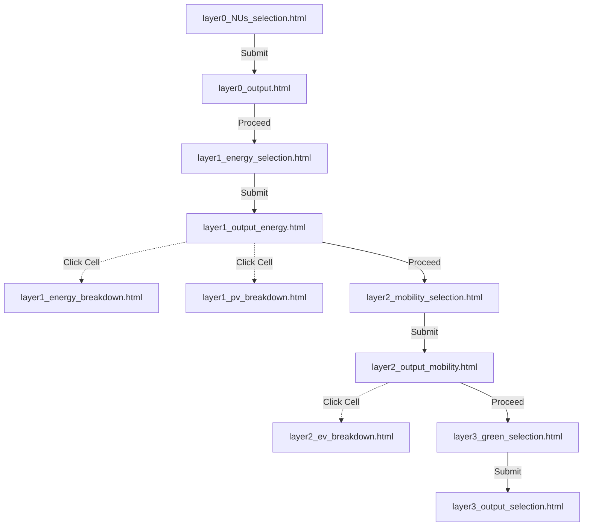

# Implementation Plan for Layer 2 & Layer 3 Interfaces

Goal: Implement new web pages for Layer 2 (Mobility) and Layer 3 (Green) selections and output pages. Link them seamlessly from the existing Layer 1 output page. Ensure layout of selection items leverages the existing 2x2 grids and 2-column configurations.

## Navigation Flow

## Proposed Changes

### Layer 1 Updates
Modifying the existing Layer 1 output page to forward to Layer 2.

#### [MODIFY] [layer1_output_energy.html](file:///Users/orcunkoraliseri/Desktop/Interface/layer1_output_energy.html)
- Add a new "Proceed to Mobility Selection" `<button>` at the bottom of the content area inside a new `.submit-section`.

#### [MODIFY] [js/output_energy.js](file:///Users/orcunkoraliseri/Desktop/Interface/js/output_energy.js)
- Wire up the new "Proceed" button logic to navigate to `layer2_mobility_selection.html?neighbourhood=...`.

---

### Layer 2: Mobility Selection & Output
Creating the Mobility interface following a 2x2 grid and 1x2 row layout.

#### [NEW] [layer2_mobility_selection.html](file:///Users/orcunkoraliseri/Desktop/Interface/layer2_mobility_selection.html)
- Uses the site layout (header, sidebar).
- Section 1: Transportation (2x2 grid). Data categories for: EV, EV Public Transport, EV Charging Stations, V2G Stations. (Initially leaving image paths empty/placeholder frames).
- Section 2: Mobility (2 column 1 row setup). Data categories for: Bicycle Infrastructure, Pedestrian-oriented design. (Initially leaving image paths empty/placeholder frames).
- Submit button down below: "View Mobility Performance".

#### [NEW] [js/mobility-selection.js](file:///Users/orcunkoraliseri/Desktop/Interface/js/mobility-selection.js)
- Handle click events toggling `.active` classes.
- Save `mobilitySelections` array (`transportation` and `mobility`) to `sessionStorage`.
- Navigate to `layer2_output_mobility.html?neighbourhood=...`. 

#### [NEW] [layer2_output_mobility.html](file:///Users/orcunkoraliseri/Desktop/Interface/layer2_output_mobility.html)
- Results table showing Neighbourhood properties, Transportation choices, and Mobility choices.
- Include a "Proceed to Green Selection" button to transition to Layer 3.

#### [NEW] [js/output_mobility.js](file:///Users/orcunkoraliseri/Desktop/Interface/js/output_mobility.js)
- Retrieve `mobilitySelections` from session storage.
- Inject row into output table. 
- Format "Transportation" cells to be clickable, redirecting to `layer2_ev_breakdown.html?neighbourhood=...`, identical to the approach used in Layer 0 / Layer 1 output.

---

### Layer 3: Green Selection & Output
Creating the Green interface. 

#### [NEW] [layer3_green_selection.html](file:///Users/orcunkoraliseri/Desktop/Interface/layer3_green_selection.html)
- Section 1: Infrastructure (2x2 grid). Green Roofs, Vertical Greening Systems, Linear Greenery, Green Spaces. (Initially leaving image paths empty/placeholder frames).
- Section 2: Urban Agriculture (2 col 1 row). Roof Gardens, Food Gardens. (Initially empty frames).
- Section 3: Energy-Integrated GI (2 col 1 row). PV-Green Roofs Integrated Modules, PV-VGS Integrated Modules. (Initially empty frames).
- "View Green Performance" button.

#### [NEW] [js/green-selection.js](file:///Users/orcunkoraliseri/Desktop/Interface/js/green-selection.js)
- Handle selections for `infrastructure`, `urban_agriculture`, `energy_integrated`.
- Save state to `sessionStorage`. 
- Navigate to `layer3_output_selection.html`. 

#### [NEW] [layer3_output_selection.html](file:///Users/orcunkoraliseri/Desktop/Interface/layer3_output_selection.html)
- Render final selections table similar to prior outputs.

#### [NEW] [js/output_green.js](file:///Users/orcunkoraliseri/Desktop/Interface/js/output_green.js)
- JS logic fetching state and populating `layer3_output_selection.html` table.

## Verification Plan
### Automated Tests
- None exist for these UI-only HTML pages in the current setup. 
### Manual Verification
- The user can open `layer0_NUs_selection.html` in the browser.
- Select a neighbourhood, click view.
- In `layer1_energy_selection.html`, select some energy parameters and view output.
- In `layer1_output_energy.html`, click "Proceed to Mobility Selection". 
- Verify the layout matches requirements (2x2 for transportation, 2 col for mobility).
- Select options, click view. 
- In `layer2_output_mobility.html`, verify the table values. Click "Transportation" cells to ensure they route to `layer2_ev_breakdown.html`. Click "Proceed to Green Selection".
- Verify Layer 3 layout, select options, click view. Verify `layer3_output_selection.html` has accurate information.
