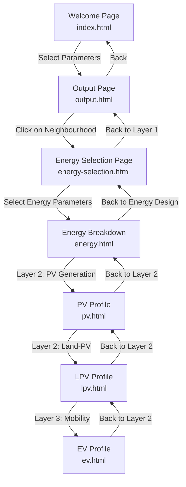

# Neighbourhood Design Interface - Implementation Plan

## Overview

A multi-layered web-based interface for designing and analyzing positive-energy district neighbourhoods through the **Simplistic Modular Holistic approach**. The interface integrates cross-sectoral systems including microgrid coordination, renewable-powered district heating, landscape-integrated photovoltaics (LPV), and electric vehicle (EV) integration with V2G functionality.

---

## Project Structure

```
/Interface/
├── index.html                      # Welcome Page (Layer 0: Parameter Selection)
├── output.html                     # Output Page (Layer 1: Buildings and Neighbourhoods)
├── energy-selection.html           # Energy Selection Page (Layer 2: Energy Design Interface)
├── energy.html                     # Energy Breakdown Page (Layer 2: Energy Performance)
├── pv.html                         # PV Generation Profile (Layer 2: Solar Energy)
├── lpv.html                        # Land-PV Profile (Layer 2: Landscape PV)
├── ev.html                         # EV Profile (Layer 3: Mobility)
│
├── css/
│   └── styles.css                  # Shared styles for all pages
│
├── js/
│   ├── data.js                     # Neighbourhood and energy data
│   ├── app.js                      # Welcome page and output page logic
│   ├── energy-selection.js         # Energy selection page logic
│   ├── energy.js                   # Treemap rendering for energy breakdown
│   ├── pv.js                       # PV profile page logic
│   ├── lpv.js                      # LPV profile page logic
│   └── ev.js                       # EV profile page logic
│
├── Content/
│   ├── Images_Usage_Parameters/    # Function parameter images (4 options)
│   ├── Images_Context_Parameters/  # Context parameter images (3 options)
│   ├── Images_Density_Parameters/  # Density parameter images (3 options)
│   ├── Images_Layout_Parameters/   # Layout parameter images (3 options)
│   ├── Images_Concept/             # Neighbourhood concept visualizations (12 images)
│   ├── Images_Neighbourhoods/      # 3D neighbourhood layouts
│   ├── Images_Buildings/           # Building type icons (19 icons)
│   ├── Images_EnergyStatus/        # Energy status indicators (Positive, Neutral, Negative)
│   ├── Images_Layer2_EnergyConsumption/  # Thermal and Electric icons
│   ├── Images_Layer2_EnergyGeneration/   # Solar, Wind, Geothermal icons
│   ├── Images_PVProfile/           # Solar irradiation and generation charts
│   ├── Images_LPVProfile/          # LPV heatmaps and cross-sections
│   └── Images_EVProfile/           # EV impact and charging state charts
│
├── Templates/
│   ├── Interface_Connections.csv  # Navigation flow data
│   ├── NUs_Energy.csv             # Neighbourhood energy data
│   └── Welcome_Page_Parameters.csv # Parameter configuration
│
├── docs/
│   ├── 0_implementation_plan.md   # This document (overview)
│   ├── 01_welcome_page.md         # Detailed Welcome Page documentation
│   ├── 02_output_page.md          # Detailed Output Page documentation
│   ├── 03_energy_selection_page.md # Detailed Energy Selection documentation
│   ├── 04_energy_breakdown_page.md # Detailed Energy Breakdown documentation
│   ├── 05_pv_profile_page.md      # Detailed PV Profile documentation
│   ├── 06_lpv_profile_page.md     # Detailed LPV Profile documentation
│   └── 07_ev_profile_page.md      # Detailed EV Profile documentation
│
└── Mockup/                        # Design mockups and references
```

---

## Navigation Flow



---

## Page Summaries

### 1. Welcome Page (`index.html`)
**Layer 0: Parameter Selection**

Initial entry point where users select neighbourhood design parameters through image-based cards. Features four parameter groups: Function (residential, commercial, mixed-use, industrial), Context (urban, suburban, rural), Density (high, medium, low), and Layout (grid, curvilinear, superblock). Uses toggle selection to store preferences in sessionStorage before navigating to the Output Page.

📄 **[View Detailed Documentation](01_welcome_page.md)**

---

### 2. Output Page (`output.html`)
**Layer 1: Buildings and Neighbourhoods**

Displays filtered neighbourhood configurations in a 4-column table showing concepts, 3D neighbourhood layouts, properties, and building composition. Dynamically filters results based on Welcome Page selections. Clicking any neighbourhood row stores the selection and navigates to the Energy Selection Page.

📄 **[View Detailed Documentation](02_output_page.md)**

---

### 3. Energy Selection Page (`energy-selection.html`)
**Layer 2: Energy Design Interface**

Intermediate selection page for choosing energy analysis parameters. Features two groups: Energy Consumption (Thermal, Electric) and Energy Generation (Solar, Wind, Geothermal). Selections stored in sessionStorage before proceeding to the detailed Energy Breakdown visualization.

📄 **[View Detailed Documentation](03_energy_selection_page.md)**

---

### 4. Energy Breakdown Page (`energy.html`)
**Layer 2: Energy Performance**

Interactive treemap visualization displaying 13 energy categories (Heating, Cooling, Lighting, Equipment, etc.) sized proportionally to consumption. Includes Energy Status indicators (Positive/Neutral/Negative) and EUI scale. Features dynamic legend with values and percentages for each category.

📄 **[View Detailed Documentation](04_energy_breakdown_page.md)**

---

### 5. PV Profile Page (`pv.html`)
**Layer 2: Solar Energy**

Two-column layout showing PV generation analysis. Left column displays input parameters (PV Surface, Efficiency, Tilt Angle, Ground Coverage) as pink horizontal bars and KPIs (Annual Generation, Ratio of Performance). Right column features Solar Irradiation 3D model and Monthly Generation chart visualizations.

📄 **[View Detailed Documentation](05_pv_profile_page.md)**

---

### 6. LPV Profile Page (`lpv.html`)
**Layer 2: Landscape PV**

Landscape-integrated photovoltaic analysis with three configurable parameters: Application Location (Parking, Walking Lanes, Bus Stops), Height of Structure (Pedestrian, Vehicle, Service), and Transparency (25%, 50%, 75%). Displays Land Use Efficiency and UHI impact metrics with heatmap and cross-section visualizations.

📄 **[View Detailed Documentation](06_lpv_profile_page.md)**

---

### 7. EV Profile Page (`ev.html`)
**Layer 3: Mobility**

Electric vehicle integration analysis featuring three parameter groups: EV Usage Ratio (0%, 50%, 100%), Charger Type (Slow, Standard, DC Fast), and Charging Scenario. Displays Added Peak Load, PV-to-EV Conversion Rate, and Total Demand KPIs with impact visualizations and state of charging analysis.

📄 **[View Detailed Documentation](07_ev_profile_page.md)**

---

## Technical Architecture

### Data Management
- **Central Data File**: `js/data.js` contains all neighbourhood configurations, energy data, and parameters
- **CSV Data Sources**:
  - `Templates/Interface_Connections.csv`: Navigation flow
  - `Templates/NUs_Energy.csv`: Energy performance data
  - `Templates/Welcome_Page_Parameters.csv`: Parameter definitions

### State Management
- **sessionStorage** used for:
  - Selected parameters from Welcome Page
  - Selected neighbourhood from Output Page
  - Energy selection parameters
- **Persistent Navigation**: State maintained across page transitions

### Styling System
- **Single CSS File**: `css/styles.css` provides consistent styling across all pages
- **Theme Colors**:
  - Purple: Function parameters
  - Pink: Context, Density, Input bars
  - Light Blue: Layout parameters
- **Responsive Design**: Mobile-friendly layouts with flexbox and grid

### JavaScript Modules
1. **data.js**: Central data repository
2. **app.js**: Welcome and Output page logic
3. **energy-selection.js**: Energy parameter selection
4. **energy.js**: Treemap visualization engine
5. **pv.js**: PV profile management
6. **lpv.js**: LPV profile management
7. **ev.js**: EV profile management

---

## Design Principles

### User Experience
1. **Progressive Disclosure**: Multi-layer approach reveals complexity gradually
2. **Visual Clarity**: Image-based selection cards for intuitive parameter selection
3. **Consistent Navigation**: Clear back/forward buttons on all pages
4. **Contextual Information**: Headers show current layer and neighbourhood context

### Visual Design
1. **Image-Driven**: Extensive use of visualization images for engagement
2. **Color-Coding**: Consistent theme colors for parameter categorization
3. **Information Hierarchy**: Clear distinction between inputs, KPIs, and visualizations
4. **Responsive Layout**: Two-column layouts for profile pages (inputs + visualizations)

### Data Integration
1. **Cross-Sectoral Analysis**: Integrates building energy, solar generation, LPV, and EV systems
2. **Performance Metrics**: Consistent KPI display across all profile pages
3. **Energy Status Indicators**: Visual feedback on energy performance (Positive/Neutral/Negative)

---

## Key Features Summary

### Layer 0: Welcome Page
- Multi-parameter selection with image cards
- Four design parameters: Function, Context, Density, Layout
- Toggle-based selection interface

### Layer 1: Buildings and Neighbourhoods
- Filtered neighbourhood results display
- 4-column table: Concepts, Neighbourhoods, Properties, Buildings
- Clickable rows for detailed analysis

### Layer 2: Energy Design
- Energy parameter selection (Consumption + Generation)
- Interactive treemap for energy breakdown (13 categories)
- Energy Status and EUI scale indicators

### Layer 2: Solar Energy Profiles
- **PV Profile**: Roof and facade solar generation with efficiency metrics
- **LPV Profile**: Landscape-integrated PV with UHI impact analysis

### Layer 3: Mobility
- **EV Profile**: Electric vehicle integration with V2G functionality

---

## Verification Plan

### Browser Testing
- [x] All image cards display correctly
- [x] Toggle selection works on all parameter cards
- [x] Submit button navigates to Output Page
- [x] Output Page displays filtered results
- [x] Back button returns to Welcome Page
- [x] Building icons render properly
- [x] Energy selection page navigation works
- [x] Treemap visualization renders correctly
- [x] PV/LPV/EV profile pages display properly
- [x] Navigation flow between all layers works seamlessly

---

## Summary

The Neighbourhood Design Interface is a sophisticated, multi-layered web application that guides users through the design and analysis of positive-energy district neighbourhoods. It seamlessly integrates:

1. **Parametric Design** (Layer 0): Intuitive parameter selection
2. **Configuration Browsing** (Layer 1): Neighbourhood exploration
3. **Energy Analysis** (Layer 2): Detailed energy consumption and generation analysis
4. **System Integration** (Layers 2-3): PV, LPV, and EV profile analysis

The interface employs a progressive disclosure approach, revealing increasing levels of detail as users navigate through the layers, making complex energy system analysis accessible and visually engaging.

---

## Documentation Index

For detailed information about each page, refer to the individual documentation files:

- **[01_welcome_page.md](01_welcome_page.md)** - Parameter selection interface
- **[02_output_page.md](02_output_page.md)** - Neighbourhood results table
- **[03_energy_selection_page.md](03_energy_selection_page.md)** - Energy parameter selection
- **[04_energy_breakdown_page.md](04_energy_breakdown_page.md)** - Treemap visualization
- **[05_pv_profile_page.md](05_pv_profile_page.md)** - PV generation analysis
- **[06_lpv_profile_page.md](06_lpv_profile_page.md)** - Landscape PV profile
- **[07_ev_profile_page.md](07_ev_profile_page.md)** - Electric vehicle integration
